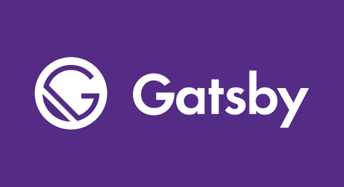
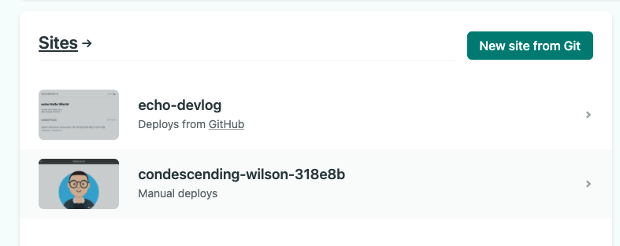
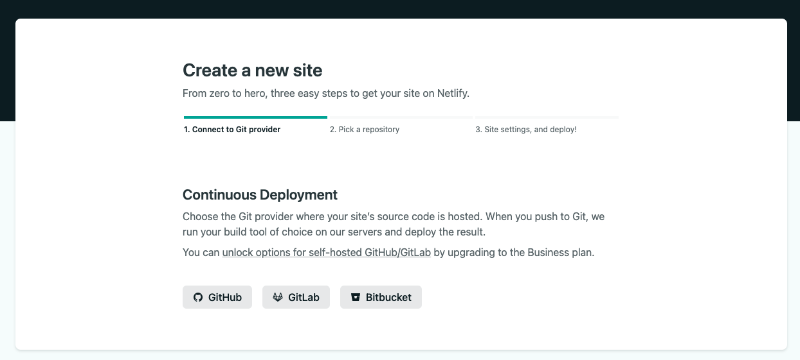
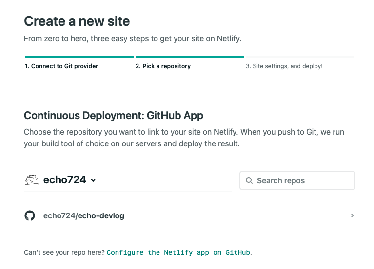
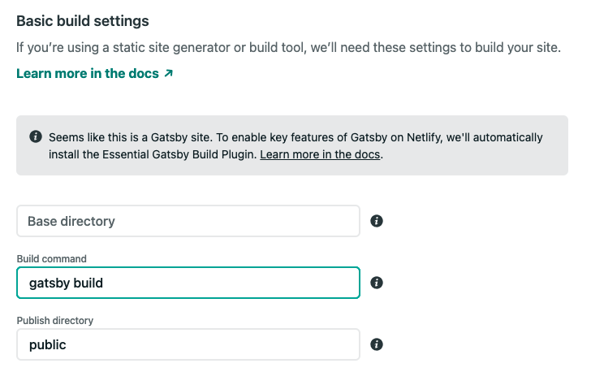

### Prerequisite
- npm 설치
- 기본적인 터미널 및 bash 명령어 이해(cd)
- Reactjs

## Intro

기술 블로그의 필요성을 꾸준히 느끼고, 기술 블로그도 몇 번 사용해봤지만, 깔끔한 나만의 기술 블로그가 있으면 좋겠다는 생각에 제작을 결심하게 되었다.

처음 기술블로그를 만들 당시 Ruby도 모르지만 Jekyll을 밑바닥부터 코드를 뜯어가며 만들었다. 웹을 대략 이해하는데 도움은 많이 되었지만, 웹에 대한 깊은 이해 부족과 컨텐츠 관리가 어려워 결국 Medium으로 옮겼다.

Medium은 글을 작성하고 올리기에 그렇게 어렵지 않았지만, 외국 사이트 특성상 한국어 지원이 별로 좋지 않았고, 코드 블럭 또한 묘하게 좋지 않았다. 결국 미디엄은 개인블로그로..

장고도 사용해보고, 리엑트, 넥스트도 공부해본 뒤, 다시 개인블로그에 도전하게 되었고, 이번 글은 React 기반 프레임워크인 Gatsby를 사용하여 개인블로그를 어떻게 만들게 됐는지 서술하려고 한다.

---

## Gatsby 이해하기

- Open source frontend framework for creating websites(Usually Static Site)
- a React-based framework
- Data Layer built on GraphQL

→ 정적 웹사이트를 만들 수 있도록 도와주는 **리엑트** 기반 프레임워크

> 비슷한 프레임워크로 Ruby 기반 **Jekyll**, Nodejs 기반 **Hexo** 등이 있음

## Gatsby StarterKit으로 시작하기

내가 지금 하려는 것은 정적 웹사이트 중에서 블로그이고, 개츠비는 다양한 블로그 starter kit을 제공한다. 나는 그 중에서 [gatsby-starter-minimal-blog](https://github.com/LekoArts/gatsby-starter-minimal-blog)를 이용해보려고 한다.

일단 `gatsby-cli`를 다운받아 명령어를 입력해야한다. ([npm](https://www.npmjs.com) 필요)

```bash
npm install gatsby-cli
```

그 다음은 스타터킷을 다운받아 프로젝트를 만들어 주는 명령어를 입력한다. 그러면 my-gatsby-project라는 폴더가 생성될 것이다.

```bash
gatsby new my-gatsby-project https://github.com/LekoArts/gatsby-starter-minimal-blog
```

제대로 설치가 됐는지 확인하기 위해서 다음 명령어들을 실행한다. 제대로 실행이 됐다면, 브라우저에 `localhost:8000` 입력했을 때, 웹페이지가 뜨면 성공이다.

```bash
cd my-gatsby-project
gatsby develop
```

## Gatsby Customize

> 커스텀 하는 것은 기술과 상관없이 시간이 오래 걸리는 일이다. 커스텀에 한 번 발을 들이기 시작하면 나같은 성격(INTP)는 빠져나오기 힘들다. 물론 구조 파악하는데도 좋지만, 글쓴이는 최대한 커스텀을 최소화 하는 것을 추천한다.

Gatsby를 커스텀하는 데에는 크게 두 경우가 있다. 

첫번째는, 템플릿 제작자가 만들어 놓은 템플릿에서 메타 데이터 정도만 수정하는 경우. 

두번째는, [Gatsby Shadowing](https://www.gatsbyjs.com/docs/conceptual/how-shadowing-works/)을 통해 제작자가 만든 컴포넌트 자체를 수정하는 것이다.

웬만하면 첫번째 경우만 하길 추천하지만, 나처럼 남과 똑같은건 싫다하는 사람들은 어쩔수 없게 건드리게 될 것이다..

첫번째의 경우는, 프로젝트 안에 `gatsby-config.js` 를 수정하면 된다.

두번째의 경우는 

[gatsby-starter-minimal-blog](https://github.com/LekoArts/gatsby-starter-minimal-blog)

[Shadowing in Gatsby Themes](https://www.gatsbyjs.com/docs/how-to/plugins-and-themes/shadowing/)

이 두 사이트를 읽어보면 알 수 있다.

간단히 요약하자면, Shadowing이란 기존 템플릿 제작자가 만들어 놓은 컴포넌트를 본인 입 맛에 맞게 수정하여 새로운 커스텀 컴포넌트를 만드는 것이다. 이때 이 컴포넌트는 본인 프로젝트 `src`폴더에 넣어야한다.

이 부분은 StarterKit마다, 제작자마다 다르기 때문에, 제작자가 쉐도잉을 어떻게 하라고 하는지에 따라 달라진다.

공통적인 부분의 팁을 주자면, 오리지널 파일을 쉐도우 하는 경우 다른 컴포넌트를 임포트할 때, 오리지널(제작자가 만든 파일)의 경우는 **절대경로**를, Shadowed 파일(사용자가 커스텀한 컴포넌트)의 경우는 **상대경로**를 사용해야한다.

예를 들면, 

```jsx
import React from "react"
import { Author } from "gatsby-theme-blog/src/components/bio"
import Card from "../components/card"
```

여기서 `Author`는 `gatsby-theme-blog`라는 **npm 패키지**, 즉 오리지널 파일의 컴포넌트고, `Card`는 쉐도잉한 파일의 컴포넌트이다.

다음과 같은 방식으로 빠르게 커스텀과 쉐도잉을 완료하면, 우리는 이제 우리의 게시글을 올리고 배포 준비를 하면 된다.

### Gatsby Shadowing 팁

- **새로운 메타태그를 넣고 싶은 경우**

내 경우에는 **google search console**에 등록하기 위해 `head`에 `meta` 태그를 넣을 일이 생겼었다. 하지만, 블로그 구조 상 `head`에 `meta`를 넣기 위해서는 3-4개의 컴포넌트를 쉐도잉 해야했기 때문에, 다른 방법을 찾다가 `html.js`를 수정하는 방법을 찾았다.

[Customizing html.js](https://www.gatsbyjs.com/docs/custom-html/)

요약하자면, 다음 명령어로 `src`에 `html.js`를 생성해주고, `head` 안에 `meta` 태그를 넣으면 된다.

```jsx
cp .cache/default-html.js src/html.js
```

---

## Netlify에 배포하기

### Netlify 소개

Netilfy는 간단히 정적 사이트 호스팅 서비스이다.

같은 계열로는 Github Pages가 있다.

Github 페이지와의 차이는 

1. `public/`을 올리냐 안올리냐
2. 도메인 네임

가 있다.

1의 경우 즉, 사용자가 빌드를 하는지, 아니면 호스팅 사이트에서 빌드를 해주는 지에 따라 다르다.

Netlify의 경우, 깃헙에 `public/` 즉, 사이트를 빌드한 후의 결과물을 레포에 올릴필요가 없다. Netlify에 연동하는 순간 자동으로 빌드를 해준다.

Github Pages는 반대로 빌드한 결과물까지 올려야 제대로 올라간다.

도메인 네임의 경우

- 넷리파이: `example.netlify.app`
- 깃헙페이지: `username.github.io`

이다.

개인적으로 도메인 네임은 깃헙페이지가 더 좋아보이는 느낌은 있다.

## Netlify에 배포하기

순서는 다음과 같다.

1. 로그인
2. Github과 연결
3. 배포할 Repo 선택
4. 설정

간단하다.

자세하게 보자면,

Netlify에 로그인 한 후, `New site from Git` 클릭



그 다음 깃헙과 연결하고



블로그로 올릴 Repo 선택



마지막으로 Build 되기 원하는 branch를 선택해주고, Build command를 `gatsby build` 로 바꿔주면 된다.



몇 분 기다리면 빌드가 완료되고 url 링크를 타고 가면 본인의 블로그가 생성되어있을 것이다.

### (Netlify Build 팁)

branch를 따로 만들어 기능을 추가하고, 안정적일 경우에만 build되는 branch에 merge하는 걸 추천한다. 안그러면 매 push마다 자동으로 빌드를 실행할 것이다.

---

## Conclusion

React기반 Gatsby로 블로그를 만들어 본 소감은 다음과 같다.

1. 커스터마이징 하기 쉽다
2. 플러그인 활용도가 높다
3. 테마가 이쁘다

Netlify도 배포 과정이 간단하기 때문에 지인이 블로그를 만든다고 한다면 강력하게 이 두 조합을 추천할 것 같다.