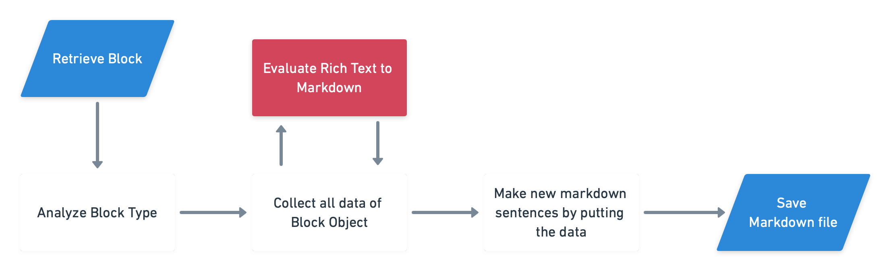

### Prerequisite

- Python3

## Intro

1부에서는 notion2md의 backend api인 notion-sdk-py의 실행 구조를 설명했다. 

2부에서는 실제 노션 api의 구조가 어떻게 되는지 살펴 볼 것이다.

## Structure Analyze

Unofficial Notion API의 구조를 분석하면서, 가장 처음 한 일은 API가 불러오는 순서를 파악하는 것이였다. 

공식 api는 다행히도 공식 문서가 있다! 

이 공식문서만 제대로 읽어도 우리는 구조를 파악하는데 큰 어려움은 없을 것이다.

### Notion Object Types

노션 api에는 크게 4가지 객체를 다루고 그 아래에 여러가지 객체들이 존재한다.

- Database

- Page

- Block

- User

이 외에도 Richtext, blockchildren, file, emoji 등등의 객체들이 있다.

여기서 우리는 User, Database는 나중에 다룰려고 한다. 

User는 마크다운 자체에서는 지원하지 않는 기능이고, 노션의 Database의 경우는 일반 마크다운에서 표현하는 표 방식으로는 표현되지 않을 경우가 더 많기 때문이다.

일단 우리가 중점으로 봐야하는 부분은 **Page**, **Block**이고 notion2md를 만들려면 그 중에서도 Block을 중점적으로 다루어야한다.

<br/>

노션의 모든 기본 단위는 **Block**이다. 

텍스트, 페이지, 타이틀, 이미지, 파일 등등 다양한 데이터들은 노션의 block 단위로 구성된다. 노션 왼쪽의 달린 점 6개가 한 개의 블럭을 표시한다고 보면 된다. 

API에서도 이 Block Object의 내용이 가장 많다.

비공식 api에서도 이런 Block Object가 있어서 그렇게 새롭진 않았지만, 공식 api에는 한 가지 객체가 더 있다. 바로** Richtext Object**이다.

## RichText Object

RichText Object는 모든 블럭들의 텍스트의 스타일 정보를 담고 있는 **최소 단위 객체**이다. 

Bold, Italic, Code 등등의 스타일 정보들이 `Boolean` type으로 제공되며, 심지어 글자 색도 지원이 된다. 

이 부분이 비공식 api의 가장 큰 차이점 중 일부가 아닐까 싶다.

전 버전에서는 모든 Block 데이터를 파이썬 class로 만들어 다루었다.

파이썬 객체인 만큼 다루기 쉬웠지만, 스타일 정보 등은 지원하지 않는 것이 단점이었다.

이제는 공식적으로 스타일을 지원하기 때문에 노션에서 작성된 페이지와 매우 유사하게 추출 할 있을 것이다.

<br/>

이 RichText Object는 Block Object의 `text` **key**에 들어가 있으며, 단어를 기준으로 나뉘어 배열로 들어가 있다.

## Block Object

노션의 한 블럭과 1:1로 매칭되는 객체이다.

타입은 노션의 블럭 타입의 개수만큼 있는게 맞지만, 몇몇 타입은 아직 지원하지 않는 것 같다.

Reference 페이지를 보면 다음과 같은 Block object 예시가 있다.

```json
	{
  "object": "block",
  "id": "9bc30ad4-9373-46a5-84ab-0a7845ee52e6",
  "created_time": "2021-03-16T16:31:00.000Z",
  "last_edited_time": "2021-03-16T16:32:00.000Z",
  "has_children": false,
  "type": "to_do",
  "archived": false,
  "to_do": {
    "text": [
      {
        "type": "text",
        "text": {
          "content": "Lacinato kale",
          "link": null
        },
        "annotations": {
          "bold": false,
          "italic": false,
          "strikethrough": false,
          "underline": false,
          "code": false,
          "color": "default"
        },
        "plain_text": "Lacinato kale",
        "href": null
      }
    ],
    "checked": false
  }
}
```

- `has_children`: 1. child page 2. tabbed block 이 두가지 중 하나가 있는지 여부를 나타낸다.

- `text`: text 하위의 데이터들이 **richtext** **object**이다.

<br/>

## Summarize

따라서 block 하나 혹은 block들을 markdown으로 변환하는데는 다음과 같은 순서를 거치면 될 것이다.

