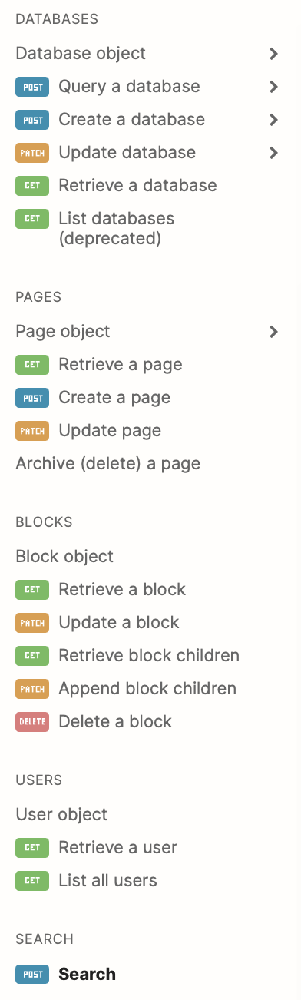

## 동기

Gatsby blog에는 글을 편집하고 작성할 수 있는 에디터가 없다. 그리고 주로 노션을 글 작성 도구로 사용해왔기 때문에, 예전처럼 노션을 CMS(Content Management System)로 사용하고 싶었다.

예전 Jekyll로 블로그를 만들었을 때도, 노션을 사용하기 위해 노션 페이지를 Markdown으로 변환해주는 프로그램인 notion2md, notion2jekyll 이란 프로그램을 만들었다. 하지만, 최근 notion2md에서 사용하는 notion-py라는 비공식 api에 에러가 생겨 notion2md를 다시 만들어야하는 상황이다.

노션에는 마크다운 export 기능이 이미 있지만, 버튼을 눌러 다운로드 받고 따로 업로드 위치에 저장해야하는 형태라 자동화가 어렵다. 노션 페이지를 마크다운으로 변환 시켜 줄 프로그램이 필요한 것이다.

찾아보니 이제 공식적으로 notion에서 api가 나왔으며, 누군가 벌써 파이썬 버전으로 만들어 둔 것이 있었다(예스,,!). 혹시나 notion2md같은 프로그램이 있을까 해서 Github에서 사용된 프로젝트들을 봤는데 아직 없는듯 하다! 당장 개발을 시작해야겠다.

---

## Prerequisites

- Notion
- pip
- python

---

## 개발 과정 개요

일단 블로그로 배포되기 위해서는 다음의 과정이 필요하다.

1. 노션의 데이터베이스(블로그 글들을 모아둔 페이지)에서 특정 블로그 게시글 페이지(블록) 데이터를 가져온다. 
2. 가져온 데이터를 마크다운으로 변환
    1. FrontMatter(title, tag, date 등)을 만들어준다.
    2. 하부 본문글을 변환한다.
3. 변환된 마크다운을 Gatsby 블로그 프로젝트 경로에 저장한다.

위의 과정을 수행하는 새로운 프로그램을 만들기 위해서는 다음 과정이 필요할 것이다.

1. notion-sdk-py 구조 및 기능 파악하기
2. notion-sdk-py를 이용해 필요한 기능 구현 해보기
3. 실험을 바탕으로 notion2md의 핵심 엔진 개발 → 마크다운 변환 기능
4. notion2md api 구현하기
5. notion2md를 활용하여 CMS 프로그램 만들기

## Notion official api를 사용하는 notion-sdk-py

원래 공식 api가 없던 시절에는 여러 비공식 api들이 있었다. 파이썬에서는 notion-py라는 api가 있었는데, 지금은 일종의 이유로 잘 작동되지 않고 있다.

하지만 이번 년도에 공식 api가 나왔고, 공식 api를 지원하는 python sdk가 생겼다. 즉, 더이상 전 api를 사용할 이유가 없어진 것이다.

아무튼 이제 notion-sdk-py가 어떻게 작동되는지 파악해보자

### notion-sdk-py import

일단 시작하기 전에 [integration token](https://www.notion.com/my-integrations)을 만들어야한다. 

[Start building with the Notion API](https://developers.notion.com/docs/authorization)

위 사이트 대로 보고 만든 다음, 상용할 노션 페이지의 share버튼을 눌러 우리가 만든 integration을 초대하면 된다.

> integration 초대가 완료된 페이지만 api 사용이 가능하다.

위 과정이 끝나면, notion-sdk-py를 설치해준다.

```bash
pip install notion-client
```

다음은 기본적인 사용법이다.

일단 python에서 notion-client를 import 해주고, 토큰을 넣으면 된다.

```python
import os
from notion_client import Client

notion = Client(auth=os.environ["NOTION_TOKEN"])
```

### notion-sdk-py의 구조 및 사용법

대략적인 구조는 Notion 공식 api reference와 python sdk의 는 1:1 매칭이다. 무슨 의미냐 하면, 공식 api의 method들과 입력으로 주어야할 파라미터들은 python sdk에서도 똑같이 구현되어 있다는 얘기이다. 바로 아래 메뉴바는 공식 레퍼런스에서 지원하는 메서들이다.



아래 코드는 notion-sdk-py/notion_client/client.py의 72부터 76번 줄이다.

```jsx
self.blocks = BlocksEndpoint(self)
self.databases = DatabasesEndpoint(self)
self.users = UsersEndpoint(self)
self.pages = PagesEndpoint(self)
self.search = SearchEndpoint(self)
```

그리고  [api_endpoints.py](https://github.com/ramnes/notion-sdk-py/blob/main/notion_client/api_endpoints.py)에 정의되어있는 method들을 보면, 공식 레퍼런스의 메소드들과 일치한다는 것을 알 수 있다.

즉, 우리는 공식 api 레퍼런스 페이지에 나온 api의 구조를 보면 python sdk의 메소드들에 무슨 input을 넣어야하고, output이 어떤 구조로 나올지 알 수 있다.

다음 편에서는 api reference를 보며 notion2md에 들어가는 기능 구현을 해볼 것이다.